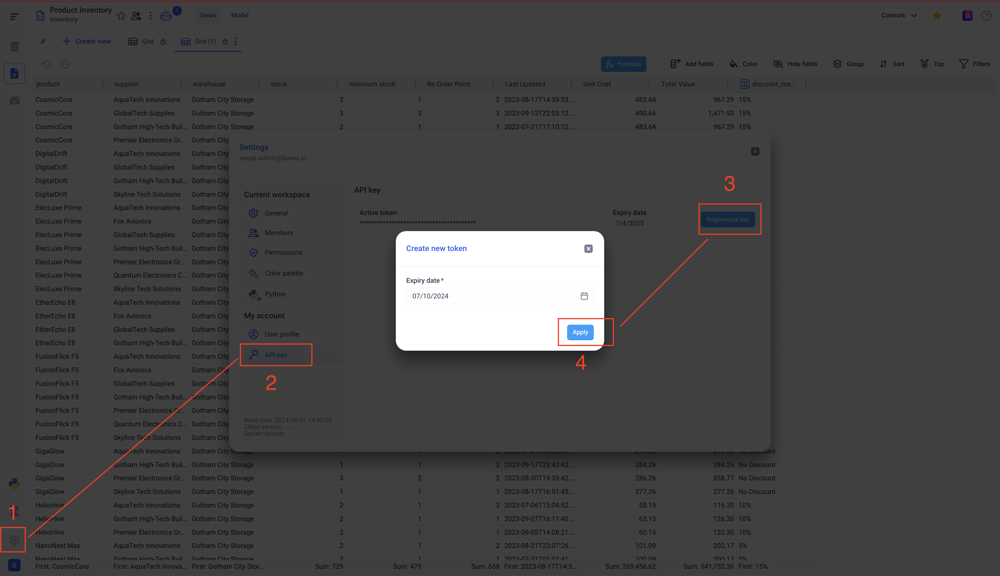

Kywy Documentation
-

KYWY is the python client to the KAWA data platform. 
You can use it to perform all the administrative tasks of your KAWA instance.
It also supports data analytics workloads: its lets you load data into KAWA and perform
computations from your Python runtime, benefitting from the scalability of your
data warehouse and from the security and governance of KAWA platform.

## Table of Contents
1. [Getting started](#1-getting-started)
2. [API Documentation](#2-api-documentation)


## 1 Getting started

### 1.a Configure credentials

Rename the `template.env` file to `.env` at the root of the kywy-documentation folder.
Fill out its content to match your installation. For example:

```bash
KAWA_API_URL=https://wayne.kawa.ai
KAWA_API_KEY=dsf4wFsrstgrsRSGrssrrghrts
KAWA_WORKSPACE=1
```

In order to obtain a valid `KAWA_API_KEY`, login into your KAWA instance, and refer to the screenshot below:

<p align="center">
  
</p>

**Make sure to use an admin account to perform all the administative tasks**. If you
want to use KYWY for data analytics workloads, any user profile will work.


__Alternatively,__ instead of using a .env file, you can set the following environment variables:

```bash
export KAWA_API_URL=https://wayne.kawa.ai
export KAWA_API_KEY=****
export KAWA_WORKSPACE=1
```


### 1.b Install the kywy package

Run the following command in the venv of your choice:

`pip install kywy`

You can then explore the content through jupyter-lab.
KYWY requires Python 3.10 or higher to run.


## 2 API Documentation

### 2.a The Data Loading API

The data loading API lets you push data to KAWA from your Python runtime.
One of its main objective it to let users push data to KAWA from any internal APIs, custom file directory structures, in-house systems etc... 
Those loads can also be scheduled using KAWA advanced scheduler.

It supports both the pandas dataframe and the arrow tables for better performances.

This API has the following features:
- Create and Update a datasource in KAWA
- Stream panda dataframes or arrow tables to KAWA
- Configuration of primary keys and partitioning

Please refer to this [Notebook](./notebooks/data-operations/01_load_data_notebook.ipynb) for a detailed documentation and examples.


### 2.b The Query API

The query API allows you to send computation queries to KAWA using a syntax similar to Spark or Snowpark.
It was built to work with any data warehouse. 
It lets you compose complex workloads to be executed on the warehouse (In order to benefit from the data warehouse scalibility and performances). 
In that way, only the necessary data will be loaded
in the memory of your Python runtime (Jupyter notebook, etc) as a pandas dataframe for further manipulation.

It exposes operators such as:
- Grouping
- Sampling
- Filtering (Both at row and group level)
- Aggregating
- Sorting
- Limiting
- Arithmetic, logic etc operations both on row and group levels
- ...

Please refer to this [Notebook](./notebooks/data-operations/02_compute_notebook.ipynb) for a detailed documentation and examples.

Another [Notebook](./notebooks/data-operations/03_superstore_example_notebook.ipynb) illustrates a simple usecase using this API.


### 2.c The Administration API

This API lets you administrate your KAWA instance through Python code.
It exposes methods to manage your users, the activated features,
etc...

Please refer to this [Notebook](./notebooks/administration/01_kawa_administration_notebook.ipynb) for details.
